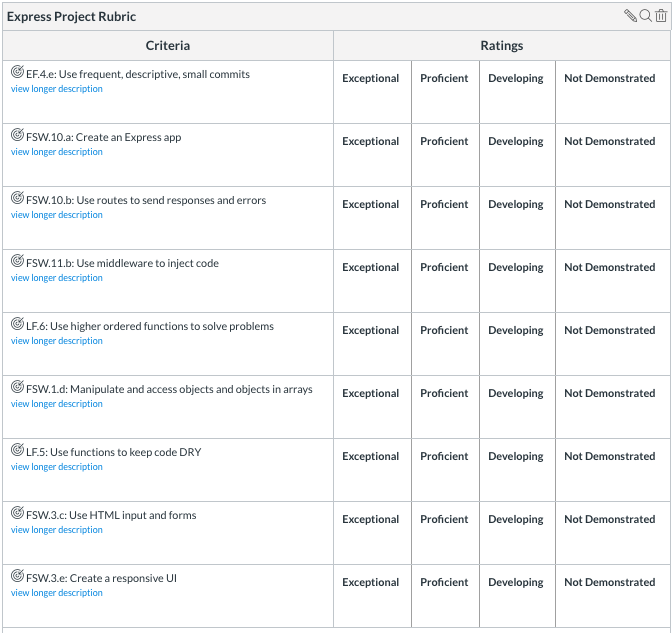

# Pursuit-Core-Web-Express-Project

## Introduction

In this lab you will be developing a server that stores data for a school, and a simple frontend. The school has the following data models:

- Classes
- Students

## Setup

1. Take a look at the JavaScript Classes in the files [`Class.js`](./Class.js), [`School.js`](./School.js) and [`Student.js`](./Student.js). They will be our models for creating objects.

2. In your server instantiate a `School` as a global variable. Something like:
    ```js
    let mySchool = new School();
    ```

3. As you saw in [`School.js`](./School.js) a `School` object has a method called `addClass()`. You will use this method to add a class to the school. Example:
    ```js 
    mySchool.addClass('physics', 'Henry Roman'); // Creates a Class Object with the name physics
    ```

4. It is your responsibility to implement and write the code for all the `School` methods outlined in [`School.js`](./School.js). The comments above the methods document what the methods should do and return. You will use these methods in your server routes.

## Details

### Classes

- `Class`es objects will be stored in the `classes`(`this.classes`) property of the `School` instance.
- The `classes` property of a `School` is itself an object where the property key is the name of the class and the property value will be a `Class` object.
- Each `Class` object has a `name` property, a `teacher` property with a string that represents the name of the instructor and a `students` property that holds an array of `Student`s currently enrolled in that class. [`Class.js`](./Class.js) is as follows: 

  ```js
  class Class {
    constructor(name, teacher) {
      this.name = name
      this.teacher = teacher
      this.students = []
    }
  }

  module.exports = Class;
  ```

### Students
- Each student within a class is an object that stores four data points or properties:
  - name
  - age
  - city
  - grade
- The `Student` class found in [`Student.js`](./Student.js) has:
  ```js
  class Student {
    constructor(name, age, city, grade) {
      this.name = name
      this.city = city
      this.age = age
      this.grade = grade
    }
  }

  module.exports = Student;
  ```
- A student can be enrolled in multiple classes. A student's grade is class dependant.

## Routes & Functionality

#### Creating a new class

| Method | Endpoint | Request Body                        |
| ------ | -------- | ----------------------------------- |
| `POST` | `/class` | Class properties: `name`, `teacher` |

- Create an Express route/endpoint to handle the request as seen above.
- The method `addClass()` in the `School` has already been implemented for you. Make sure you understand how it works. Use the `addClass()` method in your route handler.
- If the class already exists, respond with an error message.

A successful response should look like:

```json
{ 
  "class": { "name": "Physics", "teacher": "Henry Roman", "students": []},
  "message": "Created a new class",
  "timestamp": "YYYY, MM/DD HH:MM:SS"
}
```

An error response should look like:
```json
{ 
  "error": "Please fill out all the information or Class already exists",
  "timestamp": "YYYY, MM/DD HH:MM:SS"
}
```

#### Enrolling students in a class

| Method | Endpoint                     | Request Body                                       |
| ------ | ---------------------------- | -------------------------------------------------- |
| `POST` | `/class/<class-name>/enroll` | Student properties: `name`, `age`, `city`, `grade` |

- Create an Express route/endpoint to handle the request as seen above.
- Add the new student to `<class-name>` class. 
- If the student is already enrolled in the given class, update/rewrite the student's information with the new data passed.
- Implement the method `enrollStudent()` in the `School` object for accomplishing this. This method should add the student to the `students` array within the `Class` object.

A successful response should look like:

```json
{ 
  "student": { "name": "John", "age": 30, "city": "NYC", "grade": 75 },
  "className": "physics",
  "message": "Enrolled Student",
  "timestamp": "YYYY, MM/DD HH:MM:SS"
}
```

An error response should look like:
```json
{ 
  "error": "Please fill out all the information for the student",
  "timestamp": "YYYY, MM/DD HH:MM:SS"
}
```

#### List all students enrolled in a Class

| Method | Endpoint                       | Query Parameters                  |
| ------ | ------------------------------ | --------------------------------- |
| `GET`  | `/class/<class-name>/students` | `failing=true\|false`, `city=nyc` |


- Create an Express route/endpoint to handle the request as seen above.
- This endpoint should return all the students enrolled on `<class-name>`. 
- If query parameters are passed: 
  - If `failing=true`, return all students that are failing the class, that is all students whose grade is less than 70. 
  - If a `city` is passed return students whose city match the city passed. 
  - If both `failing` and `city` are passed return students that are failing and that live in the specified city.
- If not matches for students failing or in a given city are found, the `students` property of the response should have an empty array.
- If the given class `<class-name>` doesn't exist and error should be returned.
- Implement the methods `getStudentsByClass()` and `getStudentsByClassWithFilter()` in the `School` class for accomplishing this.


```json
{
  "students": [
    { "name": "John", "age": 30, "city": "NYC", "grade": 75 },
    { "name": "Emily", "age": 28, "city": "LA", "grade": 80 }
  ],
  "message": "Retrieved Students",
  "timestamp": "YYYY, MM/DD HH:MM:SS"
}
```

An error response should look like:
```json
{ 
  "error": "Class physicslol doesn't exist.",
  "timestamp": "YYYY, MM/DD HH:MM:SS"
}
```

## Frontend

Build three separate forms, for using each of the different routes:

### Form 1: Add Class

Have text inputs for:

- class name
- teacher

Have a button to submit the form to your server.  Display the response below the form.

### Form 2: Add Student

Have text inputs for:

- class
- name
- age
- city
- grade

Have a button to submit the form to your server.  Display the response below the form.

### Form 3: List Students

Have inputs for:

- class
- city (optional)

Have a checkbox input for:
 

Have a button to submit the form to your server.  Route and retrieve the appropriate information given your inputs.  Display the response below the form.

## Rubric


